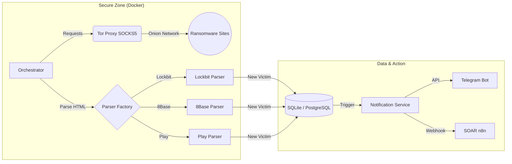

# 🛡️ RansomWatch Sentinel
### Automated Dark Web Threat Intelligence & Monitoring Stack


## 📋 Présentation

**RansomWatch Sentinel** est une infrastructure modulaire de Cyber Threat Intelligence (CTI) conçue pour surveiller de manière proactive les sites de fuites (Leak Sites) des groupes de rançongiciels sur le réseau Tor.

Contrairement aux scrapers simples, ce projet implémente une **architecture orientée objet** robuste, capable de résister à la volatilité du Dark Web (changements d'URLs, timeouts, CAPTCHAs) et d'alimenter automatiquement des chaînes de réponse à incident (SOAR).

### 🎯 Objectifs du projet
* **Collecte :** Surveillance 24/7 des nouveaux posts de victimes sur les DLS (Data Leak Sites).
* **Enrichissement :** Croisement automatique avec des APIs de Threat Intel (VirusTotal, ThreatFox).
* **Alerte :** Notification temps-réel via Telegram et webhook SOAR (n8n).
* **OpSec :** Isolation stricte du trafic via Proxy SOCKS5 Tor.

---

## 🏗️ Architecture Technique

Le projet suit une architecture de micro-services conteneurisés.



## ✨ Fonctionnalités Clés

### 1. Scraping Polymorphe (OOP)
Utilisation d'un modèle d'héritage de classes (`BaseParser`) permettant d'ajouter un nouveau groupe de ransomware en écrivant seulement les règles d'extraction CSS spécifiques, sans toucher au cœur du moteur.

### 2. Gestion Avancée du Réseau (Tor)
* Rotation automatique des circuits Tor pour éviter le bannissement.
* Gestion des "Retries" exponentiels en cas de timeout (fréquent sur le réseau Onion).
* Vérification d'intégrité de la connexion avant chaque cycle.

### 3. Pipeline d'Enrichissement
Chaque victime détectée est analysée pour identifier :
* Le secteur d'activité (via mots-clés).
* La correspondance avec des IOCs connus (Hash, IP C2).

---

## 🛠️ Stack Technologique

| Composant | Technologie | Usage |
| :--- | :--- | :--- |
| **Langage** | Python 3.10 | Core Logic, Pydantic pour la validation de données |
| **Réseau** | Tor Service | Anonymisation et accès .onion |
| **Connectivité** | Requests + PySocks | Routing HTTP via SOCKS5 |
| **Parsing** | BeautifulSoup4 | Extraction et nettoyage HTML |
| **Base de données** | SQLite / SQLAlchemy | Persistance des données et déduplication |
| **Infra** | Docker Compose | Orchestration des conteneurs (App + Proxy + DB) |

---

## 📂 Structure du Projet

L'architecture respecte les principes du "Clean Code" pour faciliter la maintenance.

```text
/ransom-monitor
│
├── core/
│   ├── network_manager.py   # Gestionnaire de session Tor (Singleton)
│   ├── database.py          # ORM SQLAlchemy
│   └── notifier.py          # Dispatcher d'alertes (Telegram/JSON)
│
├── parsers/                 # Logique modulaire
│   ├── base_parser.py       # Classe Abstraite (Parent)
│   ├── lockbit3.py          # Implémentation spécifique
│   └── play.py              # Implémentation spécifique
│
├── data/                    # Volume persistant (DB, Logs)
├── docker-compose.yml       # Déploiement Stack
└── main.py                  # Point d'entrée
```

## 🔒 Sécurité & Éthique (OpSec)

Ce projet est développé dans un cadre strict de recherche en cybersécurité :
1.  **Pas d'interaction active :** Le bot ne fait que de la lecture passive (GET requests). Aucun fichier n'est téléchargé.
2.  **Isolation :** Le code est conçu pour tourner dans un conteneur sans privilèges (rootless) avec un réseau restreint.
3.  **Données :** Aucune donnée personnelle de victime n'est stockée, seules les métadonnées de l'attaque (Nom de l'enteprise, Date, Groupe) sont conservées.

---

## 🚀 Roadmap / Prochaines étapes

- [x] Connexion Tor stable et rotation d'IP.
- [x] Parser générique et implémentation Lockbit 3.0.
- [x] Bot de notification Telegram.
- [ ] **Intégration CI/CD :** Pipeline GitHub Actions pour linting (Flake8) et scan de sécu (Bandit).
- [ ] **Dashboard :** Visualisation Streamlit pour les statistiques mensuelles.
- [ ] **API :** Exposition des données via FastAPI.

---

### 👤 Auteur
**[0x4rmiT4g3]** - *Cyber Security Engineer & Automation Enthusiast*
